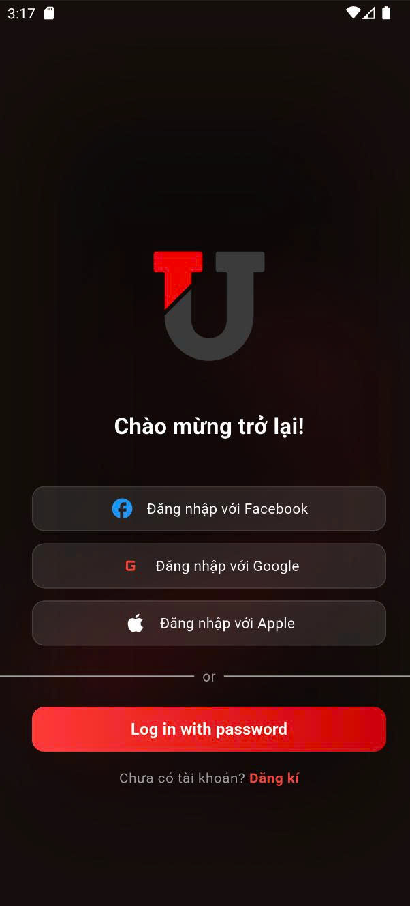
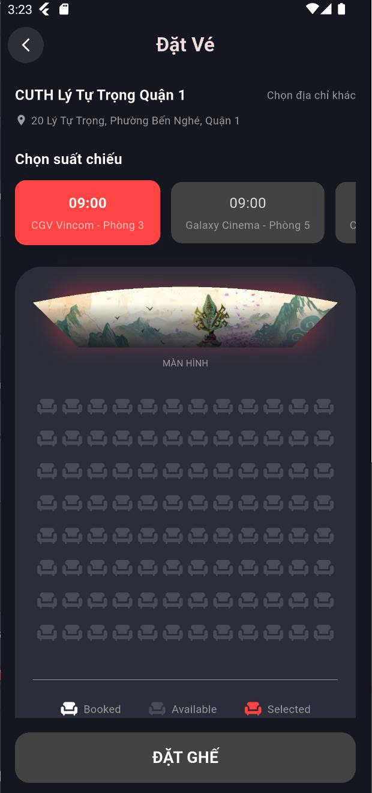
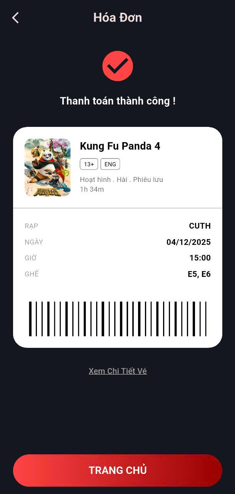

<div align="center">

# 🎬 CUTH - Hệ Thống Đặt Vé Xem Phim Trực Tuyến

[](https://flutter.dev/)
[](https://nodejs.org/)
[](https://www.mongodb.com/)
[](https://firebase.google.com/)
[](https://www.docker.com/)
[](LICENSE)

**Ứng dụng đặt vé xem phim hiện đại với kiến trúc Microservices**

[Tính năng](#-tính-năng-nổi-bật) • [Công nghệ](#-công-nghệ-sử-dụng) • [Cài đặt](#-hướng-dẫn-cài-đặt) • [Demo](#-demo--screenshots) • [Đóng góp](#-đóng-góp)

</div>

---

## 📖 Giới thiệu

**CUTH** (Cinema User Ticket Hub) là hệ thống đặt vé xem phim trực tuyến toàn diện, được xây dựng với mục đích hiện đại hóa trải nghiệm đặt vé của người dùng. Dự án áp dụng kiến trúc **Microservices** kết hợp **Clean Architecture**, đảm bảo tính mở rộng, bảo trì và hiệu suất cao.

### 💡 Giải pháp

Thay vì phải đến rạp xếp hàng chờ đợi, người dùng có thể:

- ✅ Duyệt phim đang chiếu/sắp chiếu
- ✅ Chọn suất chiếu và ghế ngồi theo thời gian thực
- ✅ Đặt mua combo bắp nước
- ✅ Thanh toán trực tuyến an toàn (VNPay)
- ✅ Nhận vé điện tử QR Code ngay lập tức
- ✅ Quản lý lịch sử đặt vé cá nhân

Đồng thời, hệ thống cung cấp **Admin Dashboard** mạnh mẽ cho nhân viên rạp chiếu:

- 🎯 Quản lý phim, suất chiếu, rạp
- 📊 Theo dõi doanh thu, thống kê
- 👥 Quản lý người dùng
- 📢 Gửi thông báo, khuyến mãi

### 🎯 Mục tiêu dự án

- 🚀 Xây dựng ứng dụng đặt vé với UX/UI hiện đại, mượt mà
- 🏗️ Áp dụng kiến trúc **Microservices** và **Clean Architecture**
- ⚡ Tối ưu hóa quy trình đặt vé thời gian thực (Real-time booking)
- 🔐 Đảm bảo bảo mật cao với JWT, Firebase Authentication
- 💳 Tích hợp thanh toán trực tuyến qua VNPay
- 📱 Hỗ trợ đa nền tảng (iOS, Android, Web)

---

## 🌟 Tính năng nổi bật

### 👤 Dành cho Khách hàng (End-User)

#### 🔐 Xác thực & Bảo mật

- Đăng ký/Đăng nhập qua Email/Password
- Đăng nhập nhanh với Google, Facebook (Firebase Authentication)
- Quên mật khẩu & xác thực 2 lớp (2FA)

#### 🎬 Khám phá Phim

- Danh sách phim đang chiếu, sắp chiếu
- Tìm kiếm phim theo tên, thể loại, diễn viên
- Thông tin chi tiết: Trailer, mô tả, đánh giá, thời lượng
- Lọc phim theo rạp, thể loại, độ tuổi

#### 🎟️ Đặt vé thông minh

- **Chọn rạp & suất chiếu:** Hiển thị suất chiếu theo ngày, giờ
- **Sơ đồ ghế trực quan:**
  - Phân biệt ghế thường, VIP, ghế đôi
  - Cập nhật trạng thái ghế real-time
  - Chọn nhiều ghế cùng lúc
- **Combo bắp nước:** Chọn combo ưu đãi hoặc tùy chỉnh

#### 💳 Thanh toán

- Tích hợp cổng thanh toán **VNPay**
- Hỗ trợ: Thẻ ATM, Visa/Mastercard, QR Code
- Lưu lịch sử giao dịch chi tiết

#### 📱 Quản lý Vé

- Vé điện tử dạng **QR Code**
- Lưu trữ vé trong ứng dụng
- Lịch sử đặt vé, chi tiêu
- Hủy vé (theo chính sách)

#### 🔔 Thông báo

- Xác nhận đặt vé qua Email/Push Notification
- Nhắc nhở trước giờ chiếu
- Thông báo khuyến mãi, phim mới

### 🛠️ Dành cho Admin/Quản lý

- **Quản lý phim:** Thêm/sửa/xóa phim, trailer, thông tin
- **Quản lý rạp & phòng chiếu:** Cấu hình ghế ngồi, thiết bị
- **Quản lý suất chiếu:** Tạo lịch chiếu, điều chỉnh giá vé
- **Quản lý người dùng:** Xem thông tin, lịch sử, khóa tài khoản
- **Báo cáo & Thống kê:** Doanh thu, vé bán, phim hot
- **Quản lý combo:** Thêm/sửa combo bắp nước, giá
- **Gửi thông báo:** Broadcast thông báo tới người dùng

---

## 🏗️ Kiến trúc hệ thống

```
┌─────────────────────────────────────────────────────────────┐
│                    Mobile App (Flutter)                     │
│          iOS / Android / Web / Desktop (macOS)             │
└─────────────────────┬───────────────────────────────────────┘
                      │ HTTPS/REST API
                      ▼
┌─────────────────────────────────────────────────────────────┐
│                   API Gateway (TypeScript)                  │
│    ✓ Routing  ✓ Auth Middleware  ✓ Caching  ✓ Logging     │
└─────────────────────┬───────────────────────────────────────┘
                      │
        ┌─────────────┼─────────────┬─────────────┬───────────┐
        ▼             ▼             ▼             ▼           ▼
    ┌────────┐  ┌──────────┐  ┌─────────┐  ┌─────────┐  ┌────────┐
    │  Auth  │  │ Booking  │  │  User   │  │ Payment │  │ Notify │
    │Service │  │ Service  │  │ Service │  │ Service │  │Service │
    └───┬────┘  └────┬─────┘  └────┬────┘  └────┬────┘  └───┬────┘
        │            │              │            │            │
        └────────────┴──────────────┴────────────┴────────────┘
                                    ▼
                    ┌───────────────────────────────┐
                    │     MongoDB 8.2.2 Cluster     │
                    │  ✓ Users  ✓ Movies  ✓ Tickets │
                    └───────────────────────────────┘
                                    │
                        ┌───────────┴───────────┐
                        ▼                       ▼
                ┌───────────────┐       ┌──────────────┐
                │Firebase Auth  │       │    VNPay     │
                │  & FCM Push   │       │   Payment    │
                └───────────────┘       └──────────────┘
```

### 📦 Cấu trúc Microservices

| Service                  | Chức năng                                 | Tech Stack                      |
| ------------------------ | ----------------------------------------- | ------------------------------- |
| **Auth Service**         | Đăng ký, đăng nhập, JWT, Firebase Auth    | Node.js, Express, JWT, bcryptjs |
| **Booking Service**      | Quản lý phim, suất chiếu, đặt vé, QR Code | Node.js, Express, QRCode        |
| **User Service**         | Quản lý profile, lịch sử, preferences     | Node.js, Express, Mongoose      |
| **Payment Service**      | VNPay integration, giao dịch, hoàn tiền   | Node.js, Express, VNPay SDK     |
| **Notification Service** | Email, Push notification, nhắc nhở        | Node.js, Nodemailer, FCM        |

---

## 💻 Công nghệ sử dụng

### 📱 Mobile App (Frontend)

| Công nghệ             | Mô tả                                                            |
| --------------------- | ---------------------------------------------------------------- |
| **Framework**         | [Flutter 3.0+](https://flutter.dev/) - Cross-platform UI toolkit |
| **Language**          | Dart                                                             |
| **State Management**  | Flutter Bloc / Provider                                          |
| **UI/UX Design**      | Figma                                                            |
| **Local Storage**     | Shared Preferences, Hive                                         |
| **Authentication**    | Firebase Authentication                                          |
| **Push Notification** | Firebase Cloud Messaging (FCM)                                   |
| **VNPAY**             | vnpay Node.js                                                    |
| **HTTP Client**       | Dio                                                              |
| **Navigation**        | go_router / AutoRoute                                            |

### ⚙️ Backend & API

#### API Gateway (TypeScript)

```typescript
- Express.js + TypeScript
- Routing & Load Balancing
- JWT Authentication Middleware
- Request Caching (node-cache)
- Rate Limiting
- Error Handling & Logging
- CORS Configuration
```

#### Microservices (JavaScript/Node.js)

**1. Auth Service**

```javascript
✓ User Registration & Login
✓ JWT Token Generation & Verification
✓ Password Hashing (bcryptjs - salt rounds: 10)
✓ Firebase Authentication Integration
✓ API Documentation (Swagger UI)
```

**2. Booking Service**

```javascript
✓ Movie & Showtime Management
✓ Seat Selection & Real-time Availability
✓ Ticket Booking Logic & Validation
✓ QR Code Generation for e-tickets
✓ Booking History & Analytics
```

**3. User Service**

```javascript
✓ User Profile Management (CRUD)
✓ Booking History & Statistics
✓ User Preferences & Settings
✓ Watchlist & Favorites
```

**4. Payment Service**

```javascript
✓ VNPay Payment Gateway Integration
✓ Transaction Processing & Verification
✓ Payment History & Invoice Generation
✓ Refund Processing
```

**5. Notification Service**

```javascript
✓ Email Notifications (Nodemailer)
✓ Push Notifications (Firebase Cloud Messaging)
✓ Booking Confirmations & Reminders
✓ Promotional Campaigns
```

### 🗄️ Database & Storage

| Công nghệ              | Mô tả                                                      |
| ---------------------- | ---------------------------------------------------------- |
| **MongoDB 8.2.2**      | NoSQL Database - User data, Bookings, Movies, Transactions |
| **Mongoose**           | ODM (Object Data Modeling) for MongoDB                     |
| **Firebase Firestore** | Real-time database for seat availability                   |
| **Firebase Storage**   | Lưu trữ hình ảnh phim, avatar                              |

**Database Schema:**

- `users` - Thông tin người dùng, authentication
- `movies` - Chi tiết phim, trailer, poster
- `theaters` - Rạp chiếu, phòng chiếu, ghế ngồi
- `showtimes` - Suất chiếu, giá vé
- `bookings` - Đặt vé, trạng thái thanh toán
- `transactions` - Lịch sử giao dịch
- `combos` - Combo bắp nước
- `notifications` - Lịch sử thông báo

### 🔐 Security & Authentication

| Công nghệ                 | Mô tả                                       |
| ------------------------- | ------------------------------------------- |
| **JWT**                   | Stateless authentication với jsonwebtoken   |
| **bcryptjs**              | Password hashing (salt rounds: 10)          |
| **Firebase Admin SDK**    | Additional authentication layer             |
| **CORS**                  | Cross-Origin Resource Sharing configuration |
| **Environment Variables** | Bảo vệ thông tin nhạy cảm (.env)            |
| **Helmet.js**             | HTTP headers security                       |
| **Rate Limiting**         | Chống DDoS, brute-force attacks             |

### ✅ Validation & Documentation

| Công nghệ              | Mô tả                         |
| ---------------------- | ----------------------------- |
| **Joi**                | Request validation schema     |
| **Swagger UI**         | Interactive API documentation |
| **JSDoc**              | Code-level documentation      |
| **Postman Collection** | API testing & examples        |

### 🐳 DevOps & Deployment

| Công nghệ          | Mô tả                              |
| ------------------ | ---------------------------------- |
| **Docker**         | Containerization (node:20-alpine)  |
| **Docker Compose** | Multi-container orchestration      |
| **Health Checks**  | Service monitoring & auto-recovery |
| **Non-root User**  | Security best practices            |
| **Git & GitHub**   | Version control & collaboration    |

### 🛠️ Development Tools

| Tool                   | Mục đích                     |
| ---------------------- | ---------------------------- |
| **Visual Studio Code** | Primary IDE                  |
| **Visual Studio 2022** | .NET development             |
| **Android Studio**     | Android emulator & debugging |
| **Xcode**              | iOS development & testing    |
| **Postman**            | API testing & documentation  |
| **MongoDB Compass**    | Database management GUI      |
| **Figma**              | UI/UX design & prototyping   |

---

## 🚀 Hướng dẫn cài đặt

### 📋 Yêu cầu hệ thống

**Mobile App:**

- Flutter SDK ≥ 3.0.0
- Dart ≥ 2.17.0
- Android Studio (Android) hoặc Xcode (iOS)
- Device/Emulator: Android 5.0+ hoặc iOS 11+

**Backend:**

- Node.js ≥ 20.x
- MongoDB ≥ 8.2.2
- Docker & Docker Compose (khuyến nghị)
- Git

**Tài khoản bên thứ 3:**

- Firebase Project (Authentication, FCM, Firestore)
- VNPay Merchant Account (để test thanh toán)

### 🔧 Cài đặt Backend

#### Bước 1: Clone Repository

```bash
git clone https://github.com/trieuhoang1212/Movie-Ticket-Booking-App.git
cd Movie-Ticket-Booking-App
```

#### Bước 2: Setup môi trường

**Sử dụng Docker (Khuyến nghị):**

```bash
cd SourceCode/Server
docker-compose up -d
```

**Hoặc setup thủ công:**

1. Cài đặt MongoDB:

```bash
# Windows: Download từ https://www.mongodb.com/try/download/community
# Linux:
sudo apt-get install mongodb-org

# Khởi động MongoDB
mongod --dbpath /your/data/path
```

2. Setup các Service:

```bash
# API Gateway
cd api-gateway
npm install
cp .env.example .env
# Chỉnh sửa .env với thông tin của bạn
npm run dev

# Auth Service
cd ../services/auth-service
npm install
cp .env.example .env
npm start

# Tương tự cho các service khác:
# - booking-service
# - user-service
# - payment-service
# - notification-service
```

#### Bước 3: Cấu hình Firebase

1. Tạo Firebase Project tại [Firebase Console](https://console.firebase.google.com/)
2. Enable **Authentication** (Email/Password, Google, Facebook)
3. Enable **Cloud Firestore** và **Firebase Storage**
4. Enable **Cloud Messaging** (FCM)
5. Tải **Service Account Key** (`FireBase_Token.json`)
6. Đặt file vào `SourceCode/Server/services/`

#### Bước 4: Cấu hình VNPay

1. Đăng ký tài khoản test tại [VNPay Sandbox](https://sandbox.vnpayment.vn/)
2. Lấy `TMN_CODE`, `HASH_SECRET`
3. Cập nhật vào `.env` của **payment-service**

```env
VNPAY_TMN_CODE=your_tmn_code
VNPAY_HASH_SECRET=your_hash_secret
VNPAY_URL=https://sandbox.vnpayment.vn/paymentv2/vpcpay.html
VNPAY_RETURN_URL=http://localhost:3000/payment/vnpay_return
```

#### Bước 5: Khởi tạo Database

```bash
cd SourceCode/Server
npm run seed  # Import dữ liệu mẫu (phim, rạp, ghế)
```

### 📱 Cài đặt Mobile App

#### Bước 1: Cài đặt Flutter

```bash
# Kiểm tra Flutter đã cài đặt
flutter --version

# Nếu chưa, tải từ: https://flutter.dev/docs/get-started/install
```

#### Bước 2: Setup Project

```bash
cd SourceCode/Client
flutter pub get
```

#### Bước 3: Cấu hình Firebase cho Mobile

1. Thêm app Android/iOS vào Firebase Project
2. Tải `google-services.json` (Android) → đặt vào `android/app/`
3. Tải `GoogleService-Info.plist` (iOS) → đặt vào `ios/Runner/`
4. Chạy FlutterFire CLI:

```bash
flutter pub global activate flutterfire_cli
flutterfire configure
```

#### Bước 4: Cấu hình API Endpoint

Sửa file `lib/core/constants/api_constants.dart`:

```dart
class ApiConstants {
  static const String baseUrl = 'http://localhost:3000'; // Đổi thành IP của bạn
  // Nếu test trên thiết bị thật: 'http://192.168.1.x:3000'
}
```

#### Bước 5: Chạy ứng dụng

```bash
# Kiểm tra devices
flutter devices

# Chạy app
flutter run

# Hoặc build
flutter build apk --release  # Android
flutter build ios --release  # iOS
```

---

## 🎮 Demo & Screenshots

> **Lưu ý:** Thêm ảnh chụp màn hình vào thư mục `demo/screenshots/`

### Mobile App

<div align="center">

|             Trang chủ              |             Chi tiết phim              |              Chọn ghế              |
| :--------------------------------: | :------------------------------------: | :--------------------------------: |
|  |  |  |

|                Thanh toán                |     |                 Profile                  |
| :--------------------------------------: | :-: | :--------------------------------------: |
|  |     |  |

</div>

## 📚 API Documentation

Sau khi chạy backend, truy cập Swagger UI:

- **API Gateway:** http://localhost:3000/api-docs
- **Auth Service:** http://localhost:3001/api-docs
- **Booking Service:** http://localhost:3002/api-docs
- **Payment Service:** http://localhost:3003/api-docs

### Ví dụ API Endpoints

#### Authentication

```http
POST /api/auth/register
POST /api/auth/login
POST /api/auth/refresh-token
GET  /api/auth/me
```

#### Movies & Showtimes

```http
GET  /api/movies
GET  /api/movies/:id
GET  /api/showtimes?movieId=xxx&date=2026-01-23
```

#### Booking

```http
POST /api/bookings
GET  /api/bookings/:id
GET  /api/bookings/user/:userId
DELETE /api/bookings/:id
```

#### Payment

```http
POST /api/payments/vnpay/create
GET  /api/payments/vnpay/return
GET  /api/payments/:bookingId
```

---

## 🧪 Testing

### Backend Testing

```bash
cd SourceCode/Server/api-gateway
npm test

# Test coverage
npm run test:coverage
```

### Mobile Testing

```bash
cd SourceCode/Client
flutter test

# Integration tests
flutter drive --target=test_driver/app.dart
```

### Manual Testing với Postman

1. Import collection: `SourceCode/Server/postman_collection.json`
2. Setup environment variables
3. Test từng endpoint

---

## 🌐 Deployment

### Backend Deployment (Docker)

```bash
cd SourceCode/Server
docker-compose -f docker-compose.prod.yml up -d
```

### Mobile App Release

**Android (APK):**

```bash
flutter build apk --release --split-per-abi
# Output: build/app/outputs/flutter-apk/
```

**iOS (IPA):**

```bash
flutter build ios --release
# Archive trong Xcode → Upload to App Store
```

**Web:**

```bash
flutter build web --release
# Deploy lên Firebase Hosting, Netlify, Vercel...
```

---

## 🐛 Troubleshooting

<details>
<summary><b>❌ Lỗi: "Unable to connect to MongoDB"</b></summary>

**Giải pháp:**

1. Kiểm tra MongoDB đang chạy: `mongod --version`
2. Kiểm tra connection string trong `.env`
3. Kiểm tra firewall/port 27017
</details>

<details>
<summary><b>❌ Lỗi: "Firebase Authentication failed"</b></summary>

**Giải pháp:**

1. Kiểm tra `FireBase_Token.json` đã copy đúng vị trí
2. Enable Authentication methods trong Firebase Console
3. Kiểm tra SHA-1/SHA-256 fingerprint (Android)
</details>

<details>
<summary><b>❌ Lỗi: "VNPay payment not working"</b></summary>

**Giải pháp:**

1. Kiểm tra `TMN_CODE`, `HASH_SECRET` trong `.env`
2. Sử dụng test cards của VNPay Sandbox
3. Kiểm tra `RETURN_URL` có đúng không
</details>

<details>
<summary><b>❌ Lỗi: "Flutter build failed"</b></summary>

**Giải pháp:**

1. `flutter clean && flutter pub get`
2. Xóa thư mục `build/`
3. Update Flutter: `flutter upgrade`
4. Kiểm tra `google-services.json` (Android) hoặc `GoogleService-Info.plist` (iOS)
</details>

---

## 🤝 Đóng góp

Chúng tôi hoan nghênh mọi đóng góp! Để đóng góp:

1. **Fork** repository
2. Tạo **feature branch** (`git checkout -b feature/AmazingFeature`)
3. **Commit** changes (`git commit -m 'Add some AmazingFeature'`)
4. **Push** to branch (`git push origin feature/AmazingFeature`)
5. Tạo **Pull Request**

### Code Style Guidelines

- **Flutter/Dart:** Tuân theo [Effective Dart](https://dart.dev/guides/language/effective-dart)
- **JavaScript/Node.js:** ESLint + Prettier
- **Commit Messages:** [Conventional Commits](https://www.conventionalcommits.org/)

---

## 📄 License

Dự án này được phân phối dưới giấy phép **MIT License**. Xem file [LICENSE](LICENSE) để biết thêm chi tiết.

```
MIT License

Copyright (c) 2026 CUTH Team

Permission is hereby granted, free of charge, to any person obtaining a copy...
```

---

## 👥 Team Members

| Vai trò                            | Thành viên         | GitHub                                                          |
| ---------------------------------- | ------------------ | --------------------------------------------------------------- |
| **Backend Developer/Project Lead** | Hoàng Triều        | https://github.com/trieuhoang1212                               |
| **Fontend Developer**              | Nguyễn Mạnh Hiền   | https://github.com/Hien-LL                                      |
| **Doc,Slide,Figma**                    | Trần Nhật Hào & Trần Nguyên Vĩ | https://github.com/nhathao-15 & https://github.com/nguyenvy2103 |

---

## 📞 Liên hệ & Hỗ trợ

- **Email:** triuu1212@gmail.com

---

## 🙏 Acknowledgments

- [Flutter Team](https://flutter.dev/) - Amazing cross-platform framework
- [Firebase](https://firebase.google.com/) - Backend services
- [VNPay](https://vnpay.vn/) - Payment gateway
- [MongoDB](https://www.mongodb.com/) - Database
- [Icons8](https://icons8.com/) - Icons & illustrations

---

<div align="center">

**⭐ Nếu project hữu ích, hãy cho chúng tôi một Star! ⭐**

Made with ❤️ by CUTH Team

[⬆ Back to Top](#-cuth---hệ-thống-đặt-vé-xem-phim-trực-tuyến)

</div>
